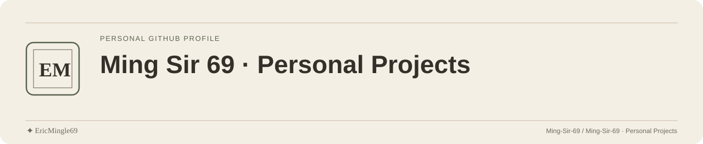

<picture>
  <source media="(prefers-color-scheme: dark)" srcset="readme-assets/header-dark.svg">
  <source media="(prefers-color-scheme: light)" srcset="readme-assets/header-light.svg">
  
</picture>

  <a href="README.md">简体中文</a> · <a href="README.en.md">English</a> · <a href="PERSONAL-NOTICE.md">✦ EricMingle69</a>

# Eric Mingle · 个人研究工作台

我在 GitHub 上是 Ming-Sir-69。我喜欢从工业工程、人因和 3D 建模出发，看人和工具之间哪里反复出错，再把能复用的部分做成小工具。现在的主线是 AI Agent 协作：知识写下以后，相关时能不能读到当前适用的版本；纠偏以后，同一个问题会不会再回来。

## 正在研究

### Engram · 多个 Agent 共用的本地知识

几个 Agent 共用一份知识时，旧事实很容易被当成当前结论。Engram 把每次纠正记成带来源的明确关系，读取时区分当前适用的内容和历史原文，相关项目出现时按关键词把它们读给 Agent。
[仓库](https://github.com/Ming-Sir-69/engram) · [架构](https://github.com/Ming-Sir-69/engram/blob/main/docs/architecture.md)

### Astra Harness · 纠偏模式与复发

我想找的是用户反复纠正背后的共同原因。Astra Harness 登记每次方向、接受与纠偏，按共同原因跨任务聚类，标记一次干预后再看它是否复发；HCD（Human Correction Distance）是其中的纠偏评估模块。
[仓库](https://github.com/Ming-Sir-69/astra-harness) · [研究路线](https://github.com/Ming-Sir-69/astra-harness/blob/main/docs/research-roadmap.md)

### read-everything-v3 · 让资料可读

文档、图片和音视频格式各异，整理起来和交给 Agent 读取都不方便。它按文件类型选择转换、OCR 或语音转写，把结果存成原文件旁边的 Markdown。
[仓库](https://github.com/Ming-Sir-69/read-everything-v3)

## 版本

| 版本 | 内容 |
| --- | --- |
| [engram v0.4.0](https://github.com/Ming-Sir-69/engram/releases/tag/v0.4.0) | 首个对应当前核心的公开版本，研究预发布 |
| [astra-harness v0.1.0](https://github.com/Ming-Sir-69/astra-harness/releases/tag/v0.1.0) | 首个公开的研究核心，研究预发布 |

这两个研究项目的公开仓里只有机制、从零合成的示例和文档，没有真实记录；版本说明机制能运行，不代表实际收益已经验证。

## 工作台之外

- [shapr3D-modeling](https://github.com/Ming-Sir-69/shapr3D-modeling)：3D 建模的练习与模型归档。
- [daily_poetry_insight_catalog](https://github.com/Ming-Sir-69/daily_poetry_insight_catalog)：按年级与单元整理的初高中语文课文目录。
- 其他课程项目与实验见[仓库列表](https://github.com/Ming-Sir-69?tab=repositories)。

保持好奇，动手验证，继续做一个快乐的海盗。🏴‍☠️

## 交流

项目问题与文档反馈，请到对应仓库提 Issue 或 Pull Request。

---

文档维护：**✦ EricMingle69** · [Ming-Sir-69](https://github.com/Ming-Sir-69)  
[个人标识、许可与权限说明](PERSONAL-NOTICE.md) · 页眉随浅色 / 深色主题切换。
